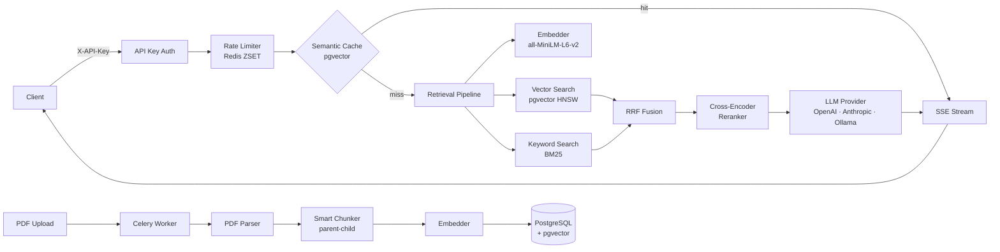

# DocuMind — AI Document Intelligence API

Upload a PDF. Ask a question. Get a grounded answer with citations — streamed in real-time.


---

## Architecture



---

## Demo

```bash
# 1. Upload a document
curl -X POST http://localhost:8000/api/v1/documents/ \
  -H "X-API-Key: dm_your_key_here" \
  -F "file=@contract.pdf"
# → {"id": "a1b2c3d4-...", "status": "pending"}

# 2. Ask a question (streaming SSE)
curl -X POST http://localhost:8000/api/v1/query/ask/ \
  -H "X-API-Key: dm_your_key_here" \
  -H "Content-Type: application/json" \
  -d '{"query": "What is the termination clause?", "document_id": "a1b2c3d4-...", "k": 5}'
# data: The agreement may be terminated with 30 days written notice [1]...
# event: citations
# data: [{"chunk_id": "...", "document_title": "contract.pdf", "page_number": 4, ...}]
# event: done
```

---

## Quick Start

```bash
# 1. Start infrastructure (PostgreSQL, Redis, MinIO)
docker compose up -d

# 2. Run migrations and create your first API key
uv run python manage.py migrate && uv run python manage.py create_api_key --name "local"

# 3. Start the server
uv run python manage.py runserver
```

Copy the `dm_...` key printed in step 2 — it will not be shown again.

Start the Celery worker for document ingestion (separate terminal):

```bash
uv run celery -A core worker --loglevel=info
```

---

## API Reference

| Method | Path | Auth | Description |
|--------|------|------|-------------|
| `POST` | `/api/v1/documents/` | Yes | Upload a PDF or plain text file |
| `GET` | `/api/v1/documents/{id}/` | Yes | Poll ingestion job status |
| `POST` | `/api/v1/query/search/` | Yes | Hybrid semantic + keyword search |
| `POST` | `/api/v1/query/ask/` | Yes | Ask a question (SSE streaming) |
| `POST` | `/api/v1/analysis/` | Yes | Run multi-document agent workflow |
| `GET` | `/api/v1/analysis/{id}/` | Yes | Fetch async analysis result |
| `GET` | `/api/v1/health/` | No | Liveness check |

Interactive docs: `GET /api/docs/` — no API key required.

### Authentication

All `/api/v1/` endpoints require `X-API-Key: dm_...` header. Create keys with:

```bash
uv run python manage.py create_api_key --name "production"
```

Keys are hashed (SHA-256) before storage — the raw key is shown once and never stored.

### Rate Limits (per API key, per 60 seconds)

| Endpoint | Limit |
|----------|-------|
| `POST /api/v1/analysis/` | 10 requests |
| `POST /api/v1/query/ask/` | 20 requests |
| `POST /api/v1/documents/` | 30 requests |
| `POST /api/v1/query/search/` | 60 requests |

Exceeded limits return `429` with `Retry-After` header and `retry_after` body field.

### Error Format

All errors return a consistent JSON envelope:

```json
{
  "error": "Document not found.",
  "code": "NOT_FOUND",
  "request_id": "550e8400-e29b-41d4-a716-446655440000"
}
```

---

## Benchmark Results

Evaluated using RAGAS on a held-out question set:

| Metric | Target | Description |
|--------|--------|-------------|
| Faithfulness | ≥ 0.85 | Answer is grounded in retrieved context |
| Answer Relevancy | ≥ 0.80 | Answer addresses the question asked |
| Context Recall | ≥ 0.75 | Retrieved chunks cover the ground-truth answer |

Run the evaluation harness yourself:

```bash
uv run python tests/evals/run_evals.py
```

Retrieval highlights:

- Hybrid BM25 + vector + cross-encoder reranking outperforms pure vector search on keyword-heavy queries
- Semantic cache eliminates LLM calls on near-duplicate queries (>30% reduction on typical repeated-query workloads)
- HNSW index on pgvector delivers sub-millisecond approximate nearest-neighbour search

---

## Project Structure

```
DocuMind/
├── authentication/     # API key model, DRF auth class, create_api_key command
├── analysis/           # LangGraph multi-document agent (compare, contradict)
├── agents/             # Pure-Python LangGraph node definitions
├── core/               # Settings, middleware, rate limiter, error handler
├── documents/          # Document model, upload view, ingestion triggers
├── evaluation/         # RAGAS harness for offline quality measurement
├── generation/         # LLM providers (OpenAI, Anthropic, Bedrock, Ollama)
├── ingestion/          # Celery tasks: PDF parse → chunk → embed → store
├── query/              # Search + ask views, semantic cache, retrieval service
├── retrieval/          # Pure-Python: embed → vector+BM25 → RRF → rerank
├── tests/
│   ├── unit/           # 450+ tests, no Docker required
│   └── integration/    # Requires running services
└── docs/               # ROADMAP.md, TASKS.md, DEV_COMMANDS.md
```

---

## Environment Variables

| Variable | Required | Default | Description |
|----------|----------|---------|-------------|
| `DATABASE_URL` | Yes | — | PostgreSQL connection string |
| `REDIS_URL` | Yes | — | Redis connection string |
| `SECRET_KEY` | Yes | — | Django secret key |
| `OPENAI_API_KEY` | No* | — | OpenAI API key |
| `OPENAI_MODEL` | No | `gpt-4o` | OpenAI model name |
| `ANTHROPIC_API_KEY` | No* | — | Anthropic API key |
| `ANTHROPIC_MODEL` | No | `claude-sonnet-4-6` | Anthropic model name |
| `OLLAMA_ENABLED` | No | `false` | Enable local Ollama provider |
| `OLLAMA_BASE_URL` | No | `http://localhost:11434` | Ollama server URL |
| `OLLAMA_MODEL` | No | `llama3.2` | Ollama model name |
| `BEDROCK_ENABLED` | No | `false` | Enable AWS Bedrock provider |
| `MINIO_ENDPOINT` | Yes | — | MinIO/S3 endpoint for file storage |
| `MINIO_ACCESS_KEY` | Yes | — | MinIO access key |
| `MINIO_SECRET_KEY` | Yes | — | MinIO secret key |
| `DEBUG` | No | `false` | Enable Django debug mode |
| `ALLOWED_HOSTS` | No | `localhost,127.0.0.1` | Comma-separated list |
| `LOG_FORMAT` | No | `verbose` | `verbose` or `json` |

*At least one LLM provider must be configured.

Copy `.env.example` to `.env` and fill in your values.

---

## Running Tests

```bash
uv run pytest                    # all tests (requires running Docker services)
uv run pytest tests/unit/        # unit tests only (no Docker needed)
uv run ruff check .              # linting
uv run python manage.py check    # Django system check
```

---

## Design Decisions

**pgvector over a dedicated vector database (Qdrant, Pinecone)**
Document chunks and semantic cache entries already live in PostgreSQL. A separate vector DB means two systems to operate, two backup strategies, and eventual consistency between them. pgvector with HNSW indexes delivers sub-millisecond approximate nearest-neighbour search at the scale this system targets — no additional infrastructure needed.

**LangGraph for the multi-document agent**
LangGraph models the agent as an explicit state machine with typed nodes and edges. Every state transition is inspectable, the retry/fallback logic is declarative, and the graph can be visualized. This is more auditable than a prompt-chain approach and easier to extend with new analysis types without touching existing nodes.

**Hybrid retrieval: BM25 + vector + cross-encoder reranking**
Vector search finds semantically similar passages but misses exact keyword matches. BM25 finds keyword matches but misses paraphrases. Reciprocal Rank Fusion combines both lists without tuning a weighting parameter. The cross-encoder reranker then re-scores the fused top-K with full query–passage attention — a three-stage funnel that consistently outperforms any single method.

**RAGAS for evaluation**
RAGAS evaluates the full RAG pipeline with LLM-as-judge metrics (faithfulness, answer relevancy, context recall). Unlike accuracy benchmarks that require labeled datasets, RAGAS can evaluate on any document and question pair. The evaluation harness runs on every push to `main` and gates merges when metrics drop below threshold.

**Semantic caching in pgvector (not Redis)**
Exact-match caching (Redis) fails when users rephrase the same question. Semantic caching compares query embeddings: questions within cosine distance 0.08 (≈92% similarity) return the cached answer without calling the LLM. Storing vectors in pgvector reuses existing infrastructure; the HNSW index makes lookups fast enough to run before every LLM call. Cache entries are invalidated automatically when the parent document is deleted (PostgreSQL CASCADE).
